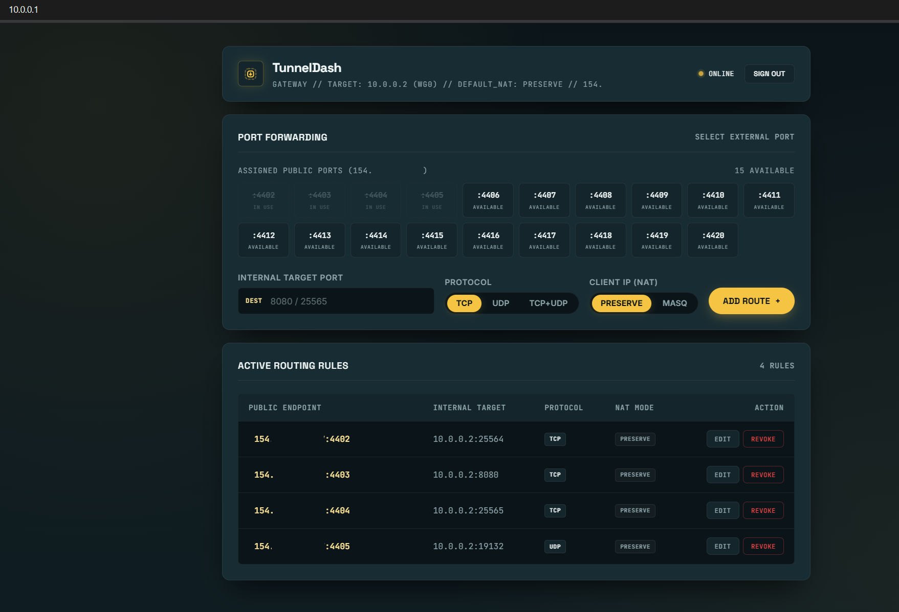

# TunnelDash

An ultra-lightweight, Native AOT compiled NAT port-forwarding management dashboard and daemon designed for low-resource edge gateways (128MB–256MB NAT VPS).



## Highlights

- **Resource Footprint:** ~11 MB RSS in idle deployment, Native AOT compiled (.NET 10). Zero external runtime dependencies.
- **Kernel-Level Routing:** Directly controls Linux `iptables` with transactional rollback, reference-counted FORWARD rules, and persistent firewall state.
- **Principle of Least Privilege:** Tight, port-specific FORWARD filtering instead of broad subnet forwarding. Only explicitly mapped endpoints are forwarded.
- **Real Client IP Preservation:** Supports transparent port forwarding without SNAT/MASQUERADE when the downstream network is configured with a return path for the original client IP.
- **Security First:** Rate-limited authentication, constant-time HMAC-SHA256 session handling, CSRF origin verification, and private-network-oriented deployment.
- **Minimalist Industrial Interface:** Monochromatic high-contrast control panel with instant endpoint clipboard replication.

## Table of Contents

- [Architecture](#architecture)
- [Private Network Compatibility](#private-network-compatibility)
  - [WireGuard Guide (Reference)](#wireguard)
  - [Tailscale Guide](#tailscale)
  - [Other Private Networks](#other-private-or-overlay-networks)
- [Prerequisites](#prerequisites)
- [Quick Start](#quick-start)
- [Automated Deployment](#automated-deployment-optional)
- [Security Notice](#security-notice)
- [License](#license)

## Architecture

TunnelDash is a **port-forwarding gateway**, not a VPN implementation. The private network can be WireGuard, Tailscale, OpenVPN, or another routed/overlay network, provided the gateway can reach the configured `TARGET_IP` and Linux forwarding/firewall rules permit the traffic.

By default, TunnelDash uses `wg0` as its private network interface, but any interface can be selected via the `PRIVATE_INTERFACE` environment variable (e.g., `tailscale0`, `tun0`).

### Generic traffic flow

```text
[Internet Client: 203.0.113.5]
       │
       ▼  (e.g. :4402 TCP/UDP)
[NAT VPS Gateway]
       │
       │  TunnelDash / iptables DNAT
       ▼
[Private Network Interface]
       │
       ├── WireGuard: wg0
       ├── Tailscale: tailscale0
       ├── OpenVPN: tun0
       └── Other routed / overlay interface
       │
       ▼
[Downstream Server: TARGET_IP]
```

### Transparent forwarding flow

When client-IP preservation is enabled, the source address is intentionally left untouched:

```text
Internet Client 203.0.113.5
        │
        ▼
NAT VPS Gateway
        │  DNAT
        ▼
Private Network
        │
        ▼
Downstream Server
sees source = 203.0.113.5
        │
        ▼
Return traffic must route back through the gateway
```

## Private Network Compatibility

TunnelDash only needs a reachable path from the gateway to `TARGET_IP`. The underlying private network does not need to be WireGuard-specific in principle.

For any private/overlay network, verify these conditions:

1. The private interface is up and has a working route to `TARGET_IP`.
2. IPv4 forwarding is enabled on the gateway.
3. The gateway firewall permits the forwarded traffic.
4. The downstream service is listening on the expected destination port.
5. Return traffic has a valid path back to the gateway.
6. If SNAT/MASQUERADE is used, the downstream host can simply reply to the translated source address.
7. If real client IP preservation is used, the downstream host must route replies back through the gateway instead of its normal internet gateway.

Useful checks on the gateway:

```bash
ip link
ip addr
ip route
ip route get <TARGET_IP>
sysctl net.ipv4.ip_forward
```

Then verify the forwarding path with:

```bash
sudo iptables -t nat -S
sudo iptables -S FORWARD
sudo tcpdump -n -i <PRIVATE_INTERFACE> host <TARGET_IP>
```

### Supported deployment guides

- [WireGuard](#wireguard)
- [Tailscale](#tailscale)
- [Other private-or-overlay networks](#other-private-or-overlay-networks)

## Prerequisites

Before running TunnelDash, ensure your gateway host meets the following requirements:

- **Operating System:** Debian 12/13, Ubuntu 22.04+, or another supported modern Linux distribution (x86_64).
- **Kernel IP Forwarding:** Packet forwarding must be enabled on the host:
  ```bash
  sudo sysctl -w net.ipv4.ip_forward=1
  echo "net.ipv4.ip_forward=1" | sudo tee -a /etc/sysctl.d/99-forwarding.conf
  ```
- **Netfilter Tools:** `iptables` and `iptables-persistent` must be installed:
  ```bash
  sudo apt-get update && sudo apt-get install -y iptables iptables-persistent
  ```
- **Active Private Network:** A working private/overlay interface routing traffic between the gateway and your downstream host. Common examples are WireGuard `wg0`, Tailscale `tailscale0`, and OpenVPN `tun0`.
- **Privileges:** The daemon must run as `root` (or with appropriate netfilter capabilities) to execute `iptables` commands.

## Quick Start

### 1. Build Native Binary

Compile the standalone Linux x64 binary using the provided Docker build environment:

```bash
chmod +x build.sh && ./build.sh
```

This produces a stripped, self-contained executable inside `./publish/tunneldash`.

> [!NOTE]
> **Target Environment & Build Architecture**
>
> TunnelDash is specifically engineered for low-resource edge gateways (128MB–256MB NAT VPS). Native AOT compilation requires ~1.5GB–2GB peak RAM and heavy CPU resources during IL analysis, trimming, and code generation. Attempting to compile directly on constrained nodes may trigger the Linux OOM (Out of Memory) killer. Binaries should be built on a local workstation or CI runner using Docker, then deployed as a standalone executable to the gateway.

### 2. Service Setup

Copy the template systemd service file to your system configuration:

```bash
sudo cp tunneldash.service.example /etc/systemd/system/tunneldash.service
sudo nano /etc/systemd/system/tunneldash.service
```

Configure the environment variables:

- `PASS_PHRASE`: Master administrative key for dashboard authentication (min. 12 characters).
- `TARGET_IP`: The downstream target host IP inside your private network (for example, a WireGuard peer such as `10.0.0.2` or a Tailscale node address).
- `PORT_RANGE`: Public ports assigned to your node, formatted as a range or comma-separated list (for example, `4402-4420` or `4402-4410,8080`).
- `PRIVATE_INTERFACE`: (Optional, default: `wg0`). The network interface connecting the gateway to the private/overlay network (e.g., `wg0`, `tailscale0`, `tun0`).
- `PRESERVE_CLIENT_IP`: (Optional, default: `true`). When `true`, TunnelDash avoids SNAT/MASQUERADE so the downstream server can see the real client IP. Set to `false` if your downstream host does not have policy-based routing configured.
- `ASPNETCORE_URLS`: Listening interface and port (for example, `http://10.0.0.1:80`).

Enable and start the daemon:

```bash
sudo systemctl daemon-reload
sudo systemctl enable --now tunneldash
```

## WireGuard

WireGuard is the current reference deployment and the environment used by the built-in transparent client-IP preservation example.

### Gateway

Create a working WireGuard interface on the NAT gateway, typically `wg0`, and make sure the gateway can route to the downstream peer (for example `10.0.0.2`).

Verify:

```bash
ip addr show wg0
ip route get 10.0.0.2
sudo wg show
```

Set:

```text
TARGET_IP=10.0.0.2
PRESERVE_CLIENT_IP=true
```

For simple deployments where preserving the real client IP is not required, use:

```text
PRESERVE_CLIENT_IP=false
```

### Real Client IP Preservation

When `PRESERVE_CLIENT_IP=true` is enabled, the gateway forwards packets with their original source IP address. Because the client IP is on the public internet, the downstream server must return reply packets back through the WireGuard tunnel rather than its local default gateway to avoid asymmetric routing drops.

This is achieved with Linux Policy-Based Routing and `CONNMARK` on the downstream host.

### Downstream `/etc/wireguard/wg0.conf`

On your downstream server (for example a home server or edge node at `10.0.0.2`), configure WireGuard as follows:

```ini
[Interface]
Address = 10.0.0.2/24
PrivateKey = <DOWNSTREAM_PRIVATE_KEY>

# Prevent wg-quick from overriding the machine's primary default route.
Table = off

# Mark incoming connections from the tunnel in connection tracking.
PostUp = iptables -t mangle -A PREROUTING -i %i -m conntrack --ctstate NEW -j CONNMARK --set-mark 0x1
# Restore the mark on locally generated outgoing reply packets.
PostUp = iptables -t mangle -A OUTPUT -m connmark --mark 0x1 -j CONNMARK --restore-mark

# Route marked reply packets through the WireGuard routing table.
PostUp = ip rule add fwmark 0x1 table 100
# Force all packets originating from the downstream IP into table 100 (essential for UDP/connectionless services)
PostUp = ip rule add from 10.0.0.2 table 100
PostUp = ip route add default dev %i table 100

# Loosen reverse path filtering to allow the asymmetric ingress path.
PostUp = sysctl -w net.ipv4.conf.all.rp_filter=2
PostUp = sysctl -w net.ipv4.conf.%i.rp_filter=2

# Cleanup rules when the tunnel goes down.
PostDown = iptables -t mangle -D PREROUTING -i %i -m conntrack --ctstate NEW -j CONNMARK --set-mark 0x1
PostDown = iptables -t mangle -D OUTPUT -m connmark --mark 0x1 -j CONNMARK --restore-mark
PostDown = ip rule del fwmark 0x1 table 100
PostDown = ip rule del from 10.0.0.2 table 100
PostDown = ip route flush table 100

[Peer]
PublicKey = <GATEWAY_PUBLIC_KEY>
Endpoint = <GATEWAY_PUBLIC_IP>:<PORT>
# Allow the WireGuard peer to receive return traffic for internet destinations.
AllowedIPs = 0.0.0.0/0
PersistentKeepalive = 25
```

> [!TIP]
> **Routing Table 100 Note:**
> The routing table identifier `table 100` is purely numeric and works natively out-of-the-box in Linux without requiring an alias defined in `/etc/iproute2/rt_tables`.

### Why `CONNMARK` is Required

- Standard `MARK` (`-j MARK --set-mark 0x1`) only stamps the incoming packet in `PREROUTING`.
- When the local application replies, the kernel creates a new outgoing packet which traverses the `OUTPUT` chain and does not automatically inherit that packet mark.
- **`CONNMARK`** associates the mark with the connection. `CONNMARK --restore-mark` in `OUTPUT` reapplies it so the response follows `ip rule fwmark` and exits through the WireGuard tunnel.
- `Table = off` keeps the downstream host's ordinary internet traffic on its normal routing table instead of forcing all traffic through WireGuard.

### UDP & Connectionless Protocol Caveat

While TCP sockets lock onto the established connection tuple (preserving the source IP as `10.0.0.2`), **UDP is stateless and connectionless**.

When downstream UDP applications (such as game servers, DNS, or VoIP) bind to `0.0.0.0` (`INADDR_ANY`), the Linux kernel performs a route lookup to determine the outgoing source IP *before* Netfilter connection tracking can associate the outgoing packet with the inbound session. Under a standard multi-homed downstream host, the kernel selects the default physical interface (e.g., local LAN), stamping an unexpected local IP and causing conntrack mark restoration to fail.

To ensure bidirectional UDP traffic routes seamlessly through the tunnel:
1. **Source Route Rule:** Ensure `ip rule add from <TARGET_IP> table 100` is active on the downstream host (included in the template above).
2. **Explicit Socket Binding:** Whenever possible, bind downstream UDP services explicitly to the private interface IP (`10.0.0.2`) rather than `0.0.0.0`.

### Verification

#### 1. Live Packet Inspection

Run `tcpdump` on the downstream server while connecting to a forwarded port:

```bash
sudo tcpdump -n -i wg0
```

You should see incoming packets carrying the remote client's public source IP, followed by replies using the same connection path.

#### 2. Quick HTTP IP Echo Server

To quickly test inbound connectivity and verify which source IP reaches your downstream host without installing a full web server, run this minimal Python one-liner on the downstream host:

```bash
python3 -c 'from http.server import BaseHTTPRequestHandler,HTTPServer; H=type("H",(BaseHTTPRequestHandler,),{"do_GET":lambda s:(s.send_response(200),s.send_header("Content-Type","text/plain"),s.end_headers(),s.wfile.write(s.client_address[0].encode())), "log_message":lambda *a:None}); HTTPServer(("0.0.0.0",8080),H).serve_forever()'
```

Map an external port (e.g. `4402` ➔ `8080`) in TunnelDash, then query it from an external client:

```bash
curl http://<GATEWAY_PUBLIC_IP>:4402
```

- If client IP preservation is working, it immediately returns your actual remote client IP.
- If SNAT/MASQUERADE is active, it returns the gateway's private tunnel IP (e.g. `10.0.0.1`).

#### 3. Quick UDP Echo Server

To verify inbound and outbound transparent UDP routing, run this minimal Python UDP listener on the downstream host:

```bash
python3 - <<'PY'
import socket

s = socket.socket(socket.AF_INET, socket.SOCK_DGRAM)
s.bind(("10.0.0.2", 9999))

print("Listening on 9999...")

while True:
    data, addr = s.recvfrom(1024)
    print(f"Received from {addr}")
    s.sendto(b"PONG\n", addr)
PY
```

Map an external UDP port (e.g. `4402` ➔ `9999` UDP) in TunnelDash, then send a datagram from an external client:

```bash
echo "PING" | nc -u -w2 <GATEWAY_PUBLIC_IP> 4402
```

- If preservation and policy routing succeed, the downstream terminal prints the client's real public IP, and the client receives `PONG`.

## Tailscale

Tailscale can provide the private routed path as well. On Linux, Tailscale uses kernel-mode routing by default and requires IP forwarding for routing features such as subnet routing. Tailscale also manages its own netfilter rules by default, so custom `iptables` rules should be reviewed together with Tailscale's firewall configuration.

Official references:

- [Tailscale: Configure a subnet router](https://tailscale.com/docs/features/subnet-routers/how-to/setup)
- [Tailscale: Netfilter modes](https://tailscale.com/docs/reference/netfilter-modes)
- [Tailscale: Kernel vs. userspace routing](https://tailscale.com/docs/reference/kernel-vs-userspace-routers)

### Gateway setup

Install and authenticate Tailscale on the gateway:

```bash
curl -fsSL https://tailscale.com/install.sh | sh
sudo tailscale up
```

Enable IPv4 forwarding:

```bash
echo 'net.ipv4.ip_forward = 1' | sudo tee -a /etc/sysctl.d/99-tailscale.conf
sudo sysctl -p /etc/sysctl.d/99-tailscale.conf
```

Check the Tailscale interface and route to your downstream node:

```bash
ip addr show tailscale0
sudo tailscale status
ip route get <TAILSCALE_TARGET_IP>
```

Use the downstream node's reachable private address as `TARGET_IP`.

### Recommended mode: SNAT / MASQUERADE

For the simplest Tailscale deployment, set `PRIVATE_INTERFACE=tailscale0` and use SNAT/MASQUERADE (`PRESERVE_CLIENT_IP=false`) so that the downstream server can reply to the gateway without needing a custom route back to every internet client:

```text
TARGET_IP=<TAILSCALE_NODE_IP>
PRIVATE_INTERFACE=tailscale0
PRESERVE_CLIENT_IP=false
```

Tailscale's default netfilter mode is `on`, where it creates and positions its own firewall rules. If custom forwarding rules behave unexpectedly, inspect the active Tailscale netfilter/firewall mode before changing it. Tailscale supports `on`, `nodivert`, and `off` modes; `off` transfers responsibility for all Tailscale firewall rules to the operator.

### Real Client IP Preservation with Tailscale

Preserving the original public client IP through Tailscale requires turning the NAT VPS gateway into a Subnet Router and routing return traffic for forwarded connections back through the gateway.

> [!NOTE]
> The `0.0.0.0/0` route used below is intentional: it provides a routed return path for transparent port forwarding when the downstream host must send internet-destined replies back through the Tailscale gateway. This is different from the usual Tailscale use case of providing whole-network internet egress through an exit node.

#### 1. Gateway (NAT VPS) Configuration
Advertise the default route or the internet block through Tailscale:
```bash
sudo tailscale up --advertise-routes=0.0.0.0/0 --snat-subnet-routes=false
```
> Approve the advertised route in the Tailscale Admin Console under the gateway node's route settings.

#### 2. Downstream Server Configuration
Start Tailscale without letting it automatically install and position its netfilter hooks:
```bash
sudo tailscale up --accept-routes --netfilter-mode=nodivert
```

> [!WARNING]
> `--netfilter-mode=nodivert` means Tailscale's automatically managed firewall rules are not active in their normal position. The downstream host's firewall is therefore your responsibility. Make sure it explicitly allows the forwarded service traffic arriving via `tailscale0`, including traffic whose source is the original public client IP.

Apply the downstream routing and mark restoration rules (matching your `PRIVATE_INTERFACE=tailscale0`):
```bash
# Mark incoming packets from the tunnel
sudo iptables -t mangle -A PREROUTING -i tailscale0 -m conntrack --ctstate NEW -j CONNMARK --set-mark 0x1
sudo iptables -t mangle -A OUTPUT -m connmark --mark 0x1 -j CONNMARK --restore-mark

# Policy routing for marked & source packets
sudo ip rule add fwmark 0x1 table 100
sudo ip rule add from <TARGET_IP> table 100
sudo ip route add default dev tailscale0 table 100

# Loosen rp_filter
sudo sysctl -w net.ipv4.conf.all.rp_filter=2
sudo sysctl -w net.ipv4.conf.tailscale0.rp_filter=2
```

## Other Private or Overlay Networks

WireGuard and Tailscale are the most common examples, but TunnelDash does not fundamentally require either technology. The same networking model can be used with another routed private interface such as OpenVPN (`tun0`), ZeroTier, Nebula, or a custom tunnel.

For another network, the checklist is always the same:

```text
1. Private interface exists
2. TARGET_IP is routable through that interface
3. IPv4 forwarding is enabled
4. FORWARD policy permits the traffic
5. DNAT maps the public port to TARGET_IP:TARGET_PORT
6. Return traffic reaches the gateway
7. SNAT can be used when transparent source-IP preservation is unnecessary
```

Check the actual path instead of assuming an interface name:

```bash
ip route get <TARGET_IP>
ip -br addr
ip route
```

### OpenVPN (`tun0`) Setup

OpenVPN operates cleanly as a routed layer-3 virtual adapter. Setting up client IP preservation with OpenVPN is structurally identical to WireGuard:

1. **Gateway Configuration:**
   Set environment variable:
   ```ini
   PRIVATE_INTERFACE=tun0
   PRESERVE_CLIENT_IP=true
   ```

2. **Downstream Client (`client.ovpn`):**
   Prevent OpenVPN from overwriting the default gateway, and attach routing scripts:
   ```text
   # Prevent overwriting default internet route
   route-nopull
   route 10.8.0.0 255.255.255.0

   # Execute routing scripts on tunnel up
   script-security 2
   up /etc/openvpn/up-rules.sh
   down /etc/openvpn/down-rules.sh
   ```

3. **Downstream `/etc/openvpn/up-rules.sh`:**
   ```bash
   #!/bin/bash
   iptables -t mangle -A PREROUTING -i tun0 -m conntrack --ctstate NEW -j CONNMARK --set-mark 0x1
   iptables -t mangle -A OUTPUT -m connmark --mark 0x1 -j CONNMARK --restore-mark
   ip rule add fwmark 0x1 table 100
   ip rule add from <TARGET_IP> table 100
   ip route add default dev tun0 table 100
   sysctl -w net.ipv4.conf.all.rp_filter=2
   sysctl -w net.ipv4.conf.tun0.rp_filter=2
   ```

If the target is reachable but replies take a different path, the connection will typically fail unless SNAT is used or policy-based routing is configured on the downstream side.

> [!NOTE]
> Simply configure `PRIVATE_INTERFACE=<INTERFACE_NAME>` (e.g., `tun0`, `tailscale0`, `zt0`) in TunnelDash's environment to automatically bind all base NAT and forwarding rules to your specific overlay interface.

## Automated Deployment (Optional)

To push updates from your local build machine to your remote gateway, set up `.env` from `.env.example`:

```bash
cp .env.example .env
nano .env
```

Run the deploy script to sync binaries and restart the service:

```bash
chmod +x deploy.sh && ./deploy.sh
```

## External Services

TunnelDash may query the following third-party public IP detection services to determine the gateway's public IPv4 address:

- api.ipify.org
- icanhazip.com
- checkip.amazonaws.com
- ifconfig.me

These services are external dependencies and are not operated or controlled by the TunnelDash project. Their availability, privacy practices, and terms of service are outside the control of this project.

## Security Notice

TunnelDash is intended to run on a dedicated NAT gateway and requires privileged access to manage Linux netfilter rules.

- Do not expose the dashboard directly to the public internet unless appropriate firewall and access controls are in place.
- Use a strong, unique `PASS_PHRASE`.
- Restrict dashboard access to a trusted private overlay network (for example, WireGuard or Tailscale) when running over HTTP without TLS.
- Review the generated `iptables` rules before deploying to production.
- When Tailscale is installed on the same gateway, review Tailscale's automatically managed firewall/netfilter rules alongside TunnelDash's rules.

## License

TunnelDash is licensed under the MIT License.

See [LICENSE](LICENSE) for the full license text.
